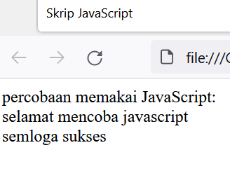
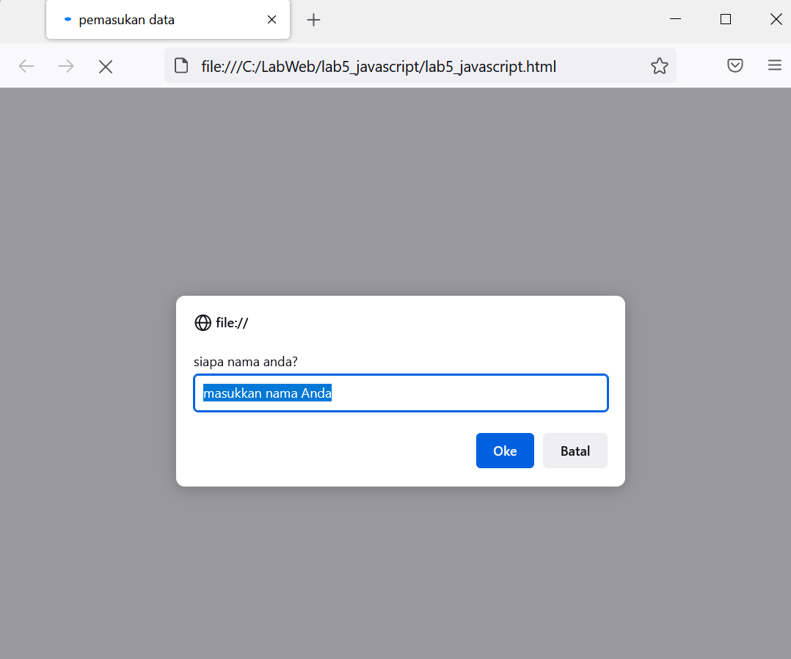
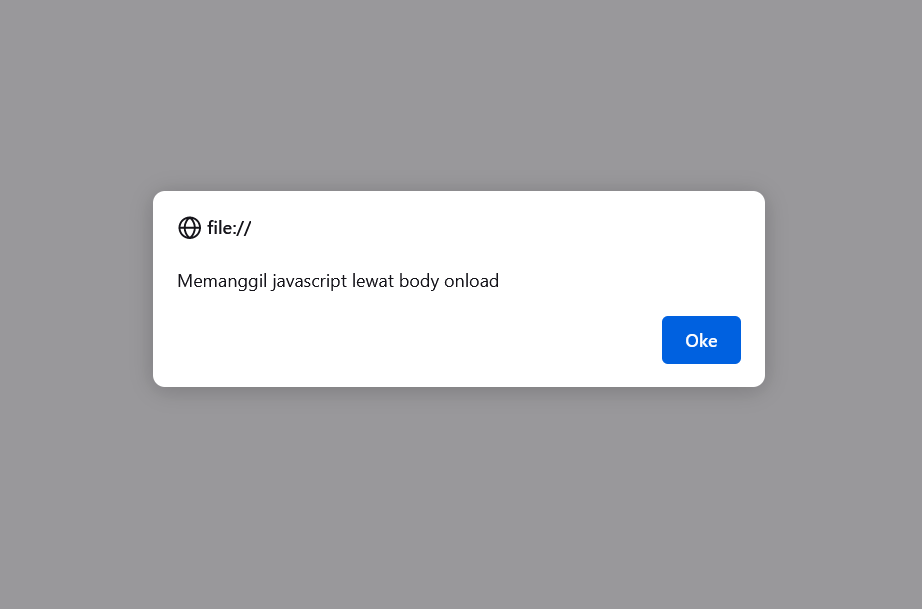

Nama  :  Kaleb Suy

NIM   :  312110390

Kelas :  TI.21.B.2

Tugas :  Pemrograman Web1 (Pertemuan 6)

Praktikum 5

# Lab5Web

- Buatlah dokumen HTML seperti berikut

- Lalu buka pada browser dan seperti ini tampilannya

## Javascrip Dasar
- Pemakaian Alert sebagai property window.

- Tampilan Alert sebagai propety window pada browser

- Pemakaian method dalam objek

- Tampilan pemakain method dalam objek pada browser

- Pemakaian Prompt. Berikut kode tag programnya

- Berikut tampilan prompt pada browser

- Pembuatan fungsi dan cara pemanggilannya, berikut kode tag prompt

- Tampilan fungsi dan cara pemanggilan prompt

### Dasar Pemrograman Di Javascript

- Operasi dasar aritmatika. Berikut tag programnya

- Tampilan pada browser awal

- Tampilan setelah kita klick pilihan aritmetich

- Seleksi kondisi (if..else)

- Penggunaan operator switch untuk seleksi kondisi

- Tampilan browser penggunaan operator switch untuk seleksi kondisi

### Pembuatan Form
- Form Input. Menginput sebuah bilangan unntuk mengetahui bilangan genap atau ganjil
- Berikut tampilan kode tag programnya

- Tampilan form input pada browser

- Form Button. Form untuk memilih salah satu dari pilihan yang tersedia
- berikut contoh kode tag programnya

- Tampilannya pada browser, form Button

- Terjadi perubahan sesuai dengan pilihan kita

#### HTML DOM
##### Pilihan menggunakan checkBox dengan perhitungan otomatis
- Berikut kode tag program menggunakan checkbox dengan perhitungan otomatis

- Tampilan output pada browser penggunaan checkbox dan perhitungan otomatis

========= TEKNIK INFORMATIKA ==========
===== UNIVERSITAS PELITA BANGSA =======
============= 2022 ==============